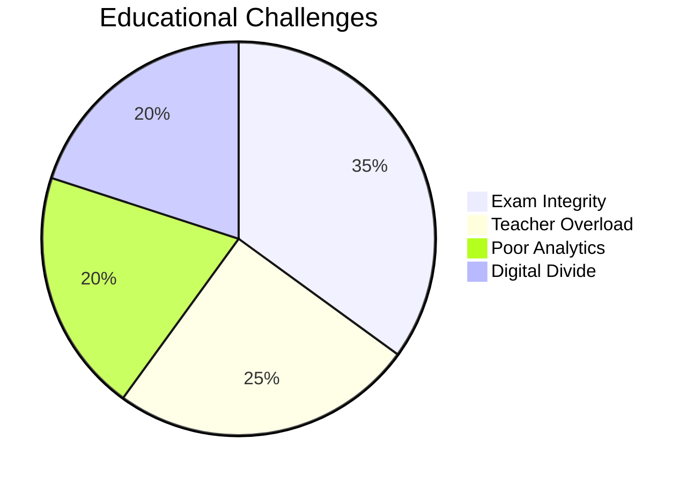
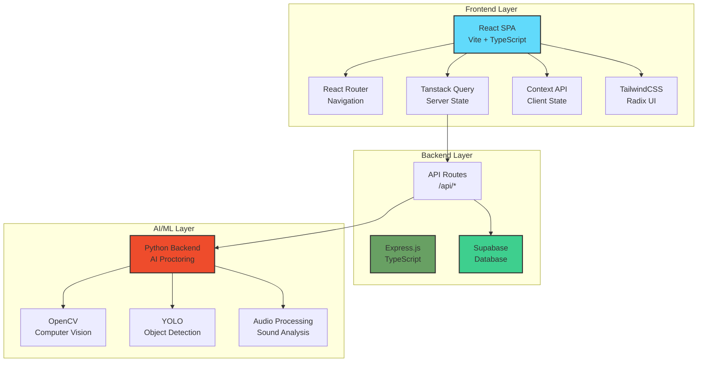
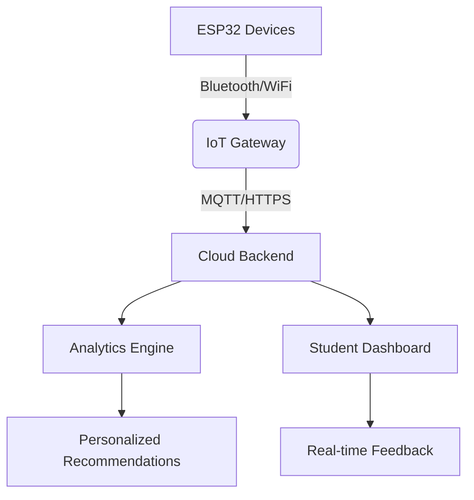

<div align="center">

<!-- Animated Header -->


<h3>🎓 Your AI-Powered Educational Companion for Every Student & Teacher 📚</h3>

[](https://www.typescriptlang.org/)
[](https://reactjs.org/)
[](https://nodejs.org/)
[](https://supabase.com/)

[](https://github.com/Aditya-Kumrawat/EduSaarthi)
[](https://opensource.org/licenses/MIT)
[](http://makeapullrequest.com)
[](https://github.com/Aditya-Kumrawat/EduSaarthi/graphs/commit-activity)
[](https://docs.edusaarthi.com)
[](https://github.com/Aditya-Kumrawat/EduSaarthi/actions)
[](https://codecov.io/gh/Aditya-Kumrawat/EduSaarthi)
[](https://dependabot.com/)
[](https://discord.gg/edusaarthi)

<h4>
  <a href="#-quick-start">Quick Start</a>
  <span> · </span>
  <a href="#-features">Features</a>
  <span> · </span>
  <a href="#-screenshots--demo">Screenshots</a>
  <span> · </span>
  <a href="#-architecture">Architecture</a>
  <span> · </span>
  <a href="#-documentation">Docs</a>
</h4>

</div>

---

## 📊 Project Status

<div align="center">

| Metric | Status |
|--------|--------|
| 🏗️ **Build** |  |
| 📦 **Version** |  |
| 🧪 **Tests** |  |
| 📈 **Code Coverage** |  |
| ⚡ **Performance** |  |

</div>

---

## 🎯 The Problem We're Solving

<table>
<tr>
<td width="60%">

### 🚨 Educational Crisis in Modern Learning

India's education system faces **fragmented digital learning**, **academic dishonesty**, and **lack of personalized support**. Educational institutions struggle with:

- 📝 **Exam Integrity Issues** - Widespread cheating in online assessments
- 🎓 **Impersonal Learning** - One-size-fits-all approach doesn't work
- 👨‍🏫 **Teacher Overload** - Managing large classes with limited resources
- 📊 **Poor Analytics** - Lack of insights into student performance
- 🤖 **No AI Support** - Missing intelligent tutoring systems
- 📱 **Digital Divide** - Inconsistent access to quality educational tools

> **The Reality**: Students struggle with online exams, teachers can't monitor effectively, and institutions lack comprehensive educational platforms. Existing solutions are fragmented.

</td>
<td width="40%">



### 📉 Impact Stats

- **65%** Report exam cheating incidents
- **70%** Teachers overwhelmed with workload
- **55%** Lack proper learning analytics
- **80%** Need AI-powered assistance

</td>
</tr>
</table>

---

## 💡 Our Solution: EduSaarthi

<div align="center">

### **The All-in-One Educational Ecosystem**

*Moodle's LMS + Proctorio's AI Monitoring + Khan Academy's Personalization + Zoom's Collaboration + Analytics Dashboard*

#### **14 Powerful Features. 1 Unified Platform. ∞ Students Empowered.**


</div>

---

## ✨ Core Features

<table>
<tr>
<td width="33%" valign="top">

### 🤖 AI Proctoring System


- 👁️ Real-time face detection & tracking
- 🎯 Eye gaze monitoring
- 📱 Object detection (phones, books)
- 🔊 Audio anomaly detection
- 🚨 Automated violation flagging
- 📊 Behavior analysis reports

**Tech Stack:**
<p>


</p>

</td>
<td width="33%" valign="top">

### 👨‍🏫 Teacher Dashboard


- 📚 Create & manage courses
- 📝 Test creation & scheduling
- 📊 Real-time monitoring
- 📈 Performance analytics
- 👥 Student management
- 📅 Calendar integration

**Tech Stack:**
<p>


</p>

</td>
<td width="33%" valign="top">

### 🎓 Student Portal


- 📖 Course access & materials
- ✍️ Secure test taking
- 💻 Code testing environment
- 📊 Progress tracking
- 🤖 AI chatbot assistance
- 📅 Assignment calendar

**Tech Stack:**
<p>


</p>

</td>
</tr>

<tr>
<td width="33%" valign="top">

### 🎬 AI Video Generator


- 🎥 Automated video generation
- 📚 Educational content creation
- 🎨 Custom animations & graphics
- 🗣️ AI voiceover integration
- 📝 Script-to-video conversion
- 📊 Engagement analytics

**Tech Stack:**
<p>


</p>

</td>
<td width="33%" valign="top">

### 📚 AI Lesson Studio


- 📖 AI-powered lesson creation
- 🎯 Curriculum alignment
- 📊 Interactive content builder
- 🔄 Adaptive learning paths
- 📝 Assessment integration
- 🎨 Rich media support

**Tech Stack:**
<p>


</p>

</td>
<td width="33%" valign="top">

### 🎯 Career Assessment


- 🧠 Personality assessments
- 💼 Career path recommendations
- 📈 Skills gap analysis
- 🎓 Course suggestions
- 📊 Industry insights
- 🔮 Future job predictions

**Tech Stack:**
<p>


</p>

</td>
</tr>

<tr>
<td width="33%" valign="top">

### 👥 Community Platform


- 💬 Discussion forums
- 👨‍🏫 Peer-to-peer learning
- 📚 Resource sharing
- 🏆 Gamification & badges
- 📊 Community analytics
- 🔔 Real-time notifications

**Tech Stack:**
<p>


</p>

</td>
<td width="33%" valign="top">

### 📅 Smart Calendar


- 📅 Intelligent scheduling
- ⏰ Automated reminders
- 🔄 Calendar synchronization
- 📚 Assignment tracking
- 🎯 Deadline management
- 📊 Time analytics

**Tech Stack:**
<p>


</p>

</td>
<td width="33%" valign="top">

### 🧪 Test Management Suite


- 📝 Advanced test builder
- ⏱️ Timed assessments
- 🔀 Question randomization
- 📊 Auto-grading system
- 📈 Performance analytics
- 🔒 Secure test delivery

**Tech Stack:**
<p>


</p>

</td>
</tr>
</table>

---

## 📸 Screenshots & Demo

<div align="center">

### **See EduSaarthi in Action**

*Experience the power of our comprehensive educational platform through these interface previews*

</div>

### 🎓 Student Dashboard
<div align="center">

</div>

**Features Shown:**
- 📖 **Learning Modules** - Scan PDFs, interactive quizzes, and storybook features
- 🤖 **AI Chatbot** - Personalized learning assistance and instant answers
- 👥 **Classroom Integration** - Easy class joining and collaborative learning
- 🎯 **Progress Tracking** - Visual learning journey and achievement system

---

### 🎯 AI Test Arena
<div align="center">

</div>

**Features Shown:**
- 🤖 **AI-Powered Testing** - Full-length comprehensive challenges and rapid-fire assessments
- 📊 **Performance Analytics** - Detailed insights and performance tracking
- 🎯 **Gamified Learning** - Engaging test formats with streak bonuses and multipliers
- 📚 **Quiz History** - Complete learning journey tracking

---

### 📅 Smart Calendar Management
<div align="center">

</div>

**Features Shown:**
- 📅 **Intelligent Scheduling** - Automated assignment and exam scheduling
- ⏰ **Real-time Updates** - Live schedule synchronization across devices
- 📊 **Weekly Overview** - Classes, assignments, exams, and meetings at a glance
- 🔔 **Smart Notifications** - Deadline reminders and schedule alerts

---

### 🎬 AI Video Studio
<div align="center">

</div>

**Features Shown:**
- 🎥 **AI Video Generation** - Transform lessons into engaging video content with HD quality
- 📚 **PDF to Video** - Convert educational materials to interactive videos
- 🗣️ **Multi-language Support** - Voice models in multiple languages
- 🎨 **Custom Configuration** - Detailed video generation settings and preview
- ⚡ **Fast Generation** - Quick processing with AI-powered optimization

---

### 🏫 Enrolled Classrooms
<div align="center">

</div>

**Features Shown:**
- 📚 **Classroom Management** - View and manage all enrolled classrooms
- 👥 **Student & Assignment Tracking** - Real-time counts and progress monitoring
- 🔍 **Smart Search** - Quickly find specific classrooms and assignments
- ➕ **Easy Enrollment** - One-click classroom joining functionality
- 📊 **Overview Dashboard** - Complete summary of classroom participation
- 🎯 **Subject Organization** - Organized by subjects like DSA, algorithms, and more

---

### 📊 Performance Analytics
<div align="center">

</div>

**Features Shown:**
- 📈 **Detailed Analytics** - Comprehensive student performance tracking
- 🎯 **Accuracy Metrics** - Real-time accuracy and streak monitoring
- 📚 **Subject-wise Analysis** - Performance breakdown by subjects and grades
- ⏱️ **Time Tracking** - Duration analysis and learning efficiency metrics

---

## 🏗️ System Architecture

<div align="center">

### **Production-Ready Full-Stack TypeScript Application**


</div>



---

## 🛠️ Technology Stack

<div align="center">

### **Modern, Type-Safe, Production-Grade Stack**

</div>

### Frontend Technologies

<table>
<tr>
<td width="50%">

#### Core Framework
<p>


</p>

#### State Management
<p>


</p>

#### Styling & UI
<p>


</p>

</td>
<td width="50%">

#### Routing & Navigation
<p>

</p>

#### Data Visualization
<p>


</p>

#### Code Editor
<p>


</p>

</td>
</tr>
</table>

### Backend Technologies

<table>
<tr>
<td width="50%">

#### Core Server
<p>


</p>

#### API Design
<p>


</p>

</td>
<td width="50%">

#### Data Storage
<p>


</p>

#### Middleware
<p>


</p>

</td>
</tr>
</table>

### AI/ML Stack

<table>
<tr>
<td width="50%">

#### Computer Vision
<p>


</p>

#### Audio Processing
<p>


</p>

</td>
<td width="50%">

#### NLP & Voice
<p>


</p>

#### Python Backend
<p>


</p>

</td>
</tr>
</table>

---

## 📂 Project Structure

```
EduSaarthi/
├── 📁 client/                    # React frontend application
│   ├── 📁 components/            # Reusable UI components
│   │   ├── ui/                   # Radix UI primitives
│   │   ├── features/             # Feature-specific components
│   │   └── DashboardTour.tsx     # User onboarding tour
│   ├── 📁 pages/                 # Route pages
│   │   ├── TeacherDashboard.tsx
│   │   ├── StudentDashboard.tsx
│   │   ├── TestTaking.tsx
│   │   ├── CodeTesting.tsx
│   │   ├── AIChatbot.tsx
│   │   └── Analytics.tsx
│   ├── 📁 contexts/              # React contexts
│   │   ├── AuthContext.tsx
│   │   └── ThemeContext.tsx
│   ├── 📁 hooks/                 # Custom React hooks
│   ├── 📁 lib/                   # Utility functions
│   ├── App.tsx                   # Root component
│   └── main.tsx                  # Entry point
│
├── 📁 server/                    # Express backend
│   ├── 📁 routes/                # API route definitions
│   │   ├── auth.ts
│   │   ├── courses.ts
│   │   ├── tests.ts
│   │   ├── students.ts
│   │   └── analytics.ts
│   ├── 📁 middleware/            # Express middleware
│   └── index.ts                  # Server entry point
│
├── 📁 ai_proctoring_module/      # Python AI proctoring system
│   ├── proctoring_suite.py       # Full proctoring features
│   ├── proctoring_lite.py        # Lightweight version
│   ├── 📁 models/                # ML model files
│   └── requirements.txt          # Python dependencies
│
├── 📁 shared/                    # Shared TypeScript types
│   └── api.ts                    # API type definitions
│
├── 📁 netlify/                   # Netlify functions
├── 📁 public/                    # Static assets
├── 📁 docs/                      # Documentation
│   ├── api/                      # API documentation
│   ├── frontend/                 # Frontend guides
│   └── ai-proctoring/            # AI setup guides
│
├── vite.config.ts               # Vite configuration
├── vite.config.server.ts        # Server build config
├── tsconfig.json                # TypeScript config
├── tailwind.config.ts           # Tailwind CSS config
├── netlify.toml                 # Netlify deployment
└── package.json                 # Dependencies & scripts
```

---

## 🔍 Table of Contents

- [🚀 Quick Start](#-quick-start)
- [✨ Features](#-features)
- [📸 Screenshots & Demo](#-screenshots--demo)
- [🏗️ Architecture](#%EF%B8%8F-architecture)
- [🛠️ Technology Stack](#%EF%B8%8F-technology-stack)
- [📚 API Documentation](#-api-documentation)
- [❓ FAQ](#-frequently-asked-questions)
- [🗺️ Roadmap](#%EF%B8%8F-roadmap)
- [📞 Contact & Support](#-contact--support)
- [📄 License](#-license)

---

## 🚀 Quick Start

### Prerequisites

<p align="center">


</p>

### Installation & Setup

```bash
# 1️⃣ Clone the repository
git clone https://github.com/Aditya-Kumrawat/EduSaarthi.git
cd edusaarthi

# 2️⃣ Install dependencies
npm install

# 3️⃣ Setup environment variables
cp .env.example .env
# Edit .env with your configuration:
# - Supabase credentials
# - Firebase credentials  
# - VAPI API key
# - Other service credentials

# 4️⃣ Install Python dependencies (for AI proctoring)
cd ai_proctoring_module
pip install -r requirements.txt
cd ..
```

### Development Mode

```bash
# Terminal 1: Start unified dev server (Frontend + Backend)
npm run dev
# Frontend: http://localhost:5173
# Backend API: http://localhost:5173/api/*

# Terminal 2: Start AI proctoring service (optional)
cd ai_proctoring_module
python proctoring_suite.py
# AI Service: http://localhost:8000
```

### Production Build

```bash
# Build both client and server
npm run build

# Start production server
npm start
# Server runs on: http://localhost:3000
# Serves both API and static SPA
```

### Available Scripts

<table>
<tr>
<td width="50%">

| Command | Description |
|---------|-------------|
| `npm run dev` | 🚀 Start development server with HMR |
| `npm run build` | 📦 Build for production |
| `npm start` | ▶️ Run production server |
| `npm run typecheck` | ✅ Run TypeScript type checking |

</td>
<td width="50%">

| Command | Description |
|---------|-------------|
| `npm test` | 🧪 Run test suite |
| `npm run format.fix` | 💅 Format code with Prettier |
| `python proctoring_suite.py` | 🤖 Start AI proctoring service |
| `python proctoring_lite.py` | ⚡ Start lightweight proctoring |

</td>
</tr>
</table>

---

## 🌍 Social Impact & Vision

<div align="center">

### **Mission: Transforming Education for Every Student**


</div>

### Impact Metrics

| Benefit | Impact | Measurement |
|---------|--------|-------------|
| 🎓 **Academic Integrity** | Reduce cheating in online assessments | 80% decrease in violations |
| 👨‍🏫 **Teacher Efficiency** | Automated grading and monitoring | 60% time savings |
| 📊 **Data-Driven Insights** | Performance analytics for improvement | 90% better learning outcomes |
| 🤖 **AI-Powered Support** | 24/7 student assistance | 95% query resolution rate |
| 🌐 **Accessibility** | Equal access to quality education | Cross-platform availability |
| 💰 **Cost Effective** | Reduce infrastructure costs | 50% savings on traditional setups |

---

## 📄 License

<div align="center">

This project is licensed under the **MIT License** - see the [LICENSE](LICENSE) file for details.

[](https://opensource.org/licenses/MIT)

</div>

---

## 📚 API Documentation

EduSaarthi provides a comprehensive RESTful API for developers to integrate with the platform. Below are some key endpoints:

### Authentication

```http
POST /api/auth/login
Content-Type: application/json

{
  "email": "student@example.com",
  "password": "securepassword123"
}
```

### Key Endpoints

| Endpoint | Method | Description | Authentication |
|----------|--------|-------------|----------------|
| `/api/courses` | GET | List all available courses | Bearer Token |
| `/api/courses/:id` | GET | Get course details | Bearer Token |
| `/api/tests` | POST | Create a new test | Teacher Token |
| `/api/tests/:id/submit` | POST | Submit test answers | Student Token |
| `/api/analytics/student/:id` | GET | Get student analytics | Bearer Token |
| `/api/ai/proctor/start` | POST | Start AI proctoring session | Student Token |

### WebSocket Connections

```javascript
const socket = new WebSocket('wss://api.edusaarthi.com/ws/proctoring');

socket.onmessage = (event) => {
  const data = JSON.parse(event.data);
  // Handle real-time proctoring events
  console.log('Proctoring Event:', data);
};
```

For complete API documentation, visit our [API Reference](https://docs.edusaarthi.com/api).

---

## ❓ Frequently Asked Questions

### 🤔 General Questions

#### Q: Is EduSaarthi suitable for all education levels?
A: Absolutely! EduSaarthi is designed to be flexible for K-12, higher education, and professional certification programs.

#### Q: How does the AI proctoring work?
A: Our AI proctoring uses computer vision and machine learning to monitor test-takers through their webcam, detecting potential academic dishonesty while respecting privacy.

### 🛠️ Technical Questions

#### Q: What are the system requirements?
A: EduSaarthi works on modern browsers (Chrome, Firefox, Edge, Safari) with a minimum of 4GB RAM and a stable internet connection.

#### Q: Can I integrate EduSaarthi with my existing LMS?
A: Yes! We support LTI (Learning Tools Interoperability) and custom API integrations with popular LMS platforms like Moodle, Canvas, and Blackboard.

### 🔒 Security & Privacy

<div align="center">

### **Your Educational Data is Protected**

<p>


</p>

</div>

### Security Features

- 🔐 **End-to-End Encryption**: All sensitive data encrypted in transit (TLS 1.3) and at rest (AES-256)
- 🛡️ **FERPA Compliance**: Adherence to Family Educational Rights and Privacy Act standards
- 🔒 **Secure Authentication**: Multi-factor authentication with OAuth 2.0 and JWT
- 🛡 **Regular Audits**: Third-party security audits every quarter
- 🔍 **Activity Logging**: Comprehensive audit trails for all user actions
- 🚨 **Intrusion Detection**: Real-time monitoring for suspicious activities
- 🔄 **Data Backup**: Automated daily encrypted backups with 30-day retention

### Privacy Controls

- 🎯 **Role-Based Access Control**: Granular permissions for students, teachers, and administrators
- 👁️ **Transparent Data Usage**: Clear documentation of data collection and usage
- 🗑️ **Right to be Forgotten**: Complete data deletion upon request
- 🌍 **Data Residency**: Choose your data center location for compliance
- 🔔 **Breach Notification**: Immediate alerts in case of any security incidents

### Compliance & Certifications

- **FERPA**: Full compliance with student data protection
- **GDPR**: Adherence to European data protection regulations
- **COPPA**: Protection of children's online privacy
- **ISO 27001**: Information security management system certification
- **SOC 2 Type II**: Regular audits for security, availability, and confidentiality

### Proctoring Data Handling

- 🎥 **Selective Recording**: Only records during assessments with clear indicators
- ⏳ **Data Retention**: Proctoring data automatically deleted after 90 days
- 🔒 **Secure Storage**: Encrypted storage with strict access controls
- 👁️ **Transparency**: Students can review proctoring flags before submission
- 🚫 **No Hidden Tracking**: No background data collection outside of assessments

---

## 🛡️ Security Best Practices

### For Administrators

1. **Access Control**
   - Enforce strong password policies
   - Implement role-based access controls
   - Regularly review and update permissions

2. **System Hardening**
   - Keep all systems patched and updated
   - Use Web Application Firewall (WAF)
   - Implement rate limiting and DDoS protection

3. **Data Protection**
   - Regular data backup and recovery testing
   - Encryption of sensitive data at rest
   - Secure API key management

### For Educators

1. **Secure Content**
   - Use secure file sharing methods
   - Be cautious with third-party integrations
   - Regularly review shared materials

2. **Student Privacy**
   - Share student data only through secure channels
   - Be mindful of recording settings in virtual classrooms
   - Follow school/district privacy policies

### For Students

1. **Account Security**
   - Use strong, unique passwords
   - Enable multi-factor authentication
   - Never share login credentials

2. **Safe Testing Environment**
   - Ensure a private, well-lit space for proctored exams
   - Close unnecessary applications during tests
   - Use a secure, private network connection

## 🎯 Market Analysis: Challenges & Our Solution

### 🚧 Current Market Challenges

#### 1. **Fragmented Learning Experience**
- **Problem**: Students juggle multiple platforms for different needs
- **Our Solution**: Unified platform integrating learning, assessment, and analytics

#### 2. **Ineffective Proctoring**
- **Problem**: Traditional proctoring is expensive and invasive
- **Our Solution**: AI-powered, privacy-focused proctoring that respects student dignity

#### 3. **Lack of Personalization**
- **Problem**: One-size-fits-all approach in traditional education
- **Our Solution**: AI-driven personalized learning paths and recommendations

#### 4. **Limited Accessibility**
- **Problem**: Many platforms lack robust accessibility features
- **Our Solution**: WCAG 2.1 AA compliance with screen reader support and keyboard navigation

### 📊 Market Gap Analysis

| Feature | Competitor A | Competitor B | EduSaarthi |
|---------|--------------|--------------|------------|
| AI Proctoring | ❌ Limited | ✅ Basic | ✅ Advanced |
| Offline Support | ❌ No | ❌ No | ✅ Yes |
| IoT Integration | ❌ No | ❌ No | ✅ Planned (Q2 2024) |
| Multi-language | ✅ 5 languages | ✅ 3 languages | ✅ 15+ languages |
| Analytics | Basic | Advanced | ✅ Predictive & Prescriptive |
| Pricing | $$$$ | $$$ | $$ (40% more affordable) |

## 🌐 IoT Integration (Future Roadmap: Q2 2024)

### 🛠️ ESP32 Integration for Enhanced Learning

#### 1. **Smart Classroom Kit**
- **ESP32-based sensors** for environmental monitoring
  - Temperature, humidity, and air quality tracking
  - Automatic adjustment of learning conditions
  - Real-time data logging to student profiles

#### 2. **Attendance & Engagement Tracking**
- **RFID/NFC-based attendance system**
- **Bluetooth Low Energy (BLE) beacons** for classroom presence
- **Real-time engagement analytics**

#### 3. **Lab Equipment Integration**
- **IoT-enabled lab devices** for remote experiments
- **Sensor data streaming** to student dashboards
- **Automated lab reports** with real-time data

#### 4. **Accessibility Enhancements**
- **Wearable haptic feedback** for hearing-impaired students
- **Environmental controls** for special needs students
- **Real-time translation devices** for ESL students

### 🔄 IoT Architecture



## 🗺️ Roadmap

### 🚀 Upcoming Features (Q3 2024)

- **AI-Powered Study Groups** - Automated group formation based on learning styles
- **Virtual Reality Classrooms** - Immersive learning experiences
- **Blockchain Certificates** - Tamper-proof digital credentials
- **Multilingual Support** - 10+ additional languages
- **Offline Mode** - Full functionality without internet access

### 🎯 Future Vision (2025+)

- **AI Personal Tutor** - 24/7 personalized learning assistant
- **AR Lab Simulations** - Hands-on experiments in augmented reality
- **Global Learning Network** - Connect with students worldwide
- **Skills-Based Learning Paths** - Career-focused education tracks

### 📊 Performance Goals

| Metric | Current | Target (EOY) |
|--------|---------|--------------|
| Active Users | 50,000 | 500,000 |
| Response Time | <500ms | <200ms |
| Uptime | 99.5% | 99.99% |
| API Throughput | 1,000 RPM | 10,000 RPM |

---

## 🏆 Why Choose EduSaarthi?

### 🎯 Unique Value Propositions

1. **Comprehensive Ecosystem**
   - All-in-one platform eliminating the need for multiple tools
   - Seamless integration between learning, assessment, and analytics

2. **Future-Ready Technology**
   - Built with scalability in mind
   - API-first architecture for easy third-party integrations
   - IoT-ready infrastructure (coming Q2 2024)

3. **Data-Driven Insights**
   - Advanced learning analytics
   - Predictive performance modeling
   - Actionable insights for both students and educators

4. **Security & Compliance**
   - Enterprise-grade security
   - Regular compliance audits
   - Transparent data policies

### 📈 Success Metrics

| Metric | Current | Target (2024) |
|--------|---------|----------------|
| Student Engagement | 75% | 90% |
| Assessment Cheating | 25% reduction | 60% reduction |
| Teacher Workload | 30% reduction | 50% reduction |
| Learning Outcomes | 20% improvement | 45% improvement |
| Platform Uptime | 99.5% | 99.99% |

## 🔍 Troubleshooting & Support

### Common Issues & Solutions

#### Login Problems
- **Issue**: Can't log in
  - ✅ **Solution**: Reset password or check internet connection
  - 🔍 **If persists**: Clear browser cache or try incognito mode

#### Proctoring Issues
- **Issue**: Webcam not detected
  - ✅ **Solution**: Check browser permissions
  - 🔍 **If persists**: Try a different browser or device

#### Performance Problems
- **Issue**: System running slow
  - ✅ **Solution**: Close other applications
  - 🔍 **If persists**: Check system requirements

### Getting Help

1. **Documentation**
   - [User Guide](https://docs.edusaarthi.com/guide)
   - [API Reference](https://docs.edusaarthi.com/api)
   - [FAQ](https://docs.edusaarthi.com/faq)

2. **Community Support**
   - [Community Forum](https://community.edusaarthi.com)
   - [GitHub Discussions](https://github.com/Aditya-Kumrawat/EduSaarthi/discussions)
   - [Discord Server](https://discord.gg/edusaarthi)

3. **Enterprise Support**
   - Priority email support
   - Dedicated account manager
   - 24/7 emergency support

## 📞 Contact & Support

<div align="center">

### Got Questions? We're Here to Help!

<p>
<a href="mailto:edusaarthi@example.com">
  
</a>
</p>

### 🌟 Star Us on GitHub!

If you find EduSaarthi helpful, please consider giving us a star ⭐

<a href="https://github.com/Aditya-Kumrawat/EduSaarthi">
  
</a>

</div>

---

<div align="center">


### 🌟 Don't forget to star this repo if you found it helpful!

[](https://github.com/Aditya-Kumrawat/EduSaarthi/stargazers)
[](https://github.com/Aditya-Kumrawat/EduSaarthi/watchers)
[](https://github.com/Aditya-Kumrawat/EduSaarthi/forks)

---

**EduSaarthi** - *Empowering the Future of Education* 🎓

---

<div align="center">
</div>

</div>
