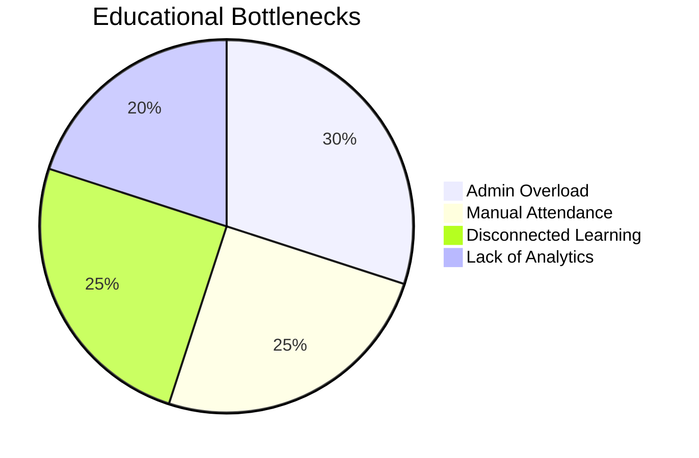
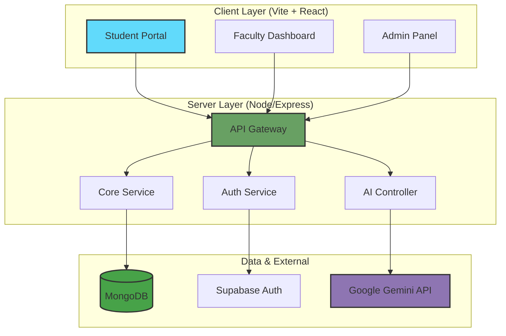

<div align="center">

<!-- Animated Header -->


<h3>🚀 The Next-Gen Student Information System for Modern Education 🎓</h3>

[](https://www.typescriptlang.org/)
[](https://reactjs.org/)
[](https://nodejs.org/)
[](https://www.mongodb.com/)
[](https://deepmind.google/technologies/gemini/)

[](https://www.netlify.com/)
[](https://opensource.org/licenses/MIT)
[](http://makeapullrequest.com)

<h4>
  <a href="#-quick-start">Quick Start</a>
  <span> · </span>
  <a href="#-features">Features</a>
  <span> · </span>
  <a href="#-tech-stack">Tech Stack</a>
  <span> · </span>
  <a href="#-architecture">Architecture</a>
</h4>

</div>

---

## 🎯 The Problem We're Solving

<table>
<tr>
<td width="60%">

### 🚨 The Academic Management Struggle

Educational institutions today are bogged down by **fragmented systems**, **manual attendance tracking**, and **disconnected communication**. Schools and colleges suffer from:

- 📋 **Paper-Based Chaos** - Manual attendance and grading are prone to errors.
- 📉 **Lack of Insights** - No real-time view of student performance or faculty efficiency.
- 🐢 **Slow Communication** - Disconnect between admins, teachers, and students.
- 🤖 **Outdated Testing** - Traditional exams lack the flexibility and smarts of modern AI.

> **The Reality**: Administrators are overwhelmed, teachers are stuck with paperwork, and students are left disengaged.

</td>
<td width="40%">



</td>
</tr>
</table>

---

## 💡 Our Solution: Edusphere SIS

<div align="center">

### **A Unified Digital Campus**

*Smart Administration + AI-Powered Testing + QR Attendance + Real-Time Analytics*

#### **Seamlessly connecting Admins, Faculty, and Students in one intuitive platform.**


</div>

---

## ✨ Core Features

<table>
<tr>
<td width="33%" valign="top">

### 📱 Smart QR Attendance


- 📷 **Scan & Go**: Students scan QR codes for instant attendance.
- 📍 **Geo-Fencing Ready**: Secure and verifiable.
- 📊 **Instant Reports**: Real-time attendance tracking for faculty.
- 📉 **Trend Analysis**: Monitor attendance patterns over time.

</td>
<td width="33%" valign="top">

### 🤖 AI Test Arena


- 🧠 **AI Question Gen**: Generate quizzes instantly using Google Gemini.
- 📝 **Auto-Grading**: Immediate feedback for students.
- ⏱️ **Timed Mode**: Simulate real exam conditions.
- 📊 **Performance Analytics**: Deep dive into weak and strong areas.

</td>
<td width="33%" valign="top">

### 🏫 Admin Command Center


- 👥 **User Management**: Seamlessly manage Students, Faculty, and Staff.
- 📅 **Course Scheduling**: Dynamic course and class allocation.
- 📈 **Institution Reports**: High-level insights on campus performance.
- 🔔 **Global Announcements**: Broadcast important news instantly.

</td>
</tr>

<tr>
<td width="33%" valign="top">

### 👨‍🏫 Faculty Dashboard


- 📚 **Course Manager**: Upload resources and manage curriculum.
- 📢 **Class Updates**: Post announcements and assignments.
- 📝 **Gradebook**: Digital marks entry and grading system.
- 📅 **Schedule View**: Personal timetable and event tracking.

</td>
<td width="33%" valign="top">

### 🎓 Student Portal


- 🎒 **My Classroom**: Access all enrolled courses and materials.
- 📈 **Result Tracker**: View academic history and progress.
- 🗓️ **Academic Calendar**: Never miss a deadline or exam.
- 💻 **AI Code Editor**: Practice coding directly in the browser.

</td>
<td width="33%" valign="top">

### 📊 Advanced Analytics


- 📉 **Performance Graphs**: Visual breakdown of grades.
- 📊 **Attendance Stats**: Detailed reports for students and admins.
- 🎯 **Gap Analysis**: Identify areas needing improvement.
- 📤 **Exportable Reports**: Generate PDF/CSV reports.

</td>
</tr>
</table>

---

## 🛠️ Technology Stack

<div align="center">

### **Built on a Robust, Scalable MERN Stack**

</div>

### Frontend
<p align="center">
  
  
  
  
  
  
</p>

### Backend & Database
<p align="center">
  
  
  
  
</p>

### Integrations & Tools
<p align="center">
  
  
  
  
</p>

---

## 🏗️ Architecture



---

## 🚀 Quick Start

### Prerequisites

- Node.js >= 18.x
- MongoDB (Local or Atlas)
- NPM or Yarn

### Installation

```bash
# 1. Clone the repository
git clone https://github.com/Aditya-Kumrawat/Edusphere.git
cd edusphere-sis

# 2. Install dependencies
npm install

# 3. Configure Environment
# Create a .env file and add your credentials:
# - MONGODB_URI
# - SUPABASE_URL & KEY
# - GEMINI_API_KEY

# 4. Run Development Server
npm run dev:full
```

The application will be available at `http://localhost:5173`.

---

## 📂 Project Structure

```
edusphere-sis/
├── 📁 src/
│   ├── 📁 components/      # Reusable UI components
│   ├── 📁 pages/           # Application pages
│   │   ├── 📁 admin/       # Administrator views
│   │   ├── 📁 faculty/     # Teacher dashboards
│   │   └── 📁 student/     # Student portal
│   ├── 📁 context/         # React Context (Auth, Theme)
│   ├── 📁 services/        # API services (api.ts)
│   └── App.tsx             # Main entry point
├── 📁 mongodb/             # Backend server & scripts
├── 📁 netlify/             # Serverless functions
└── package.json            # Dependencies
```

---

## 📞 Contact

<div align="center">

### Built with ❤️ for Education

<a href="https://github.com/Aditya-Kumrawat/Edusphere">
  
</a>

</div>
